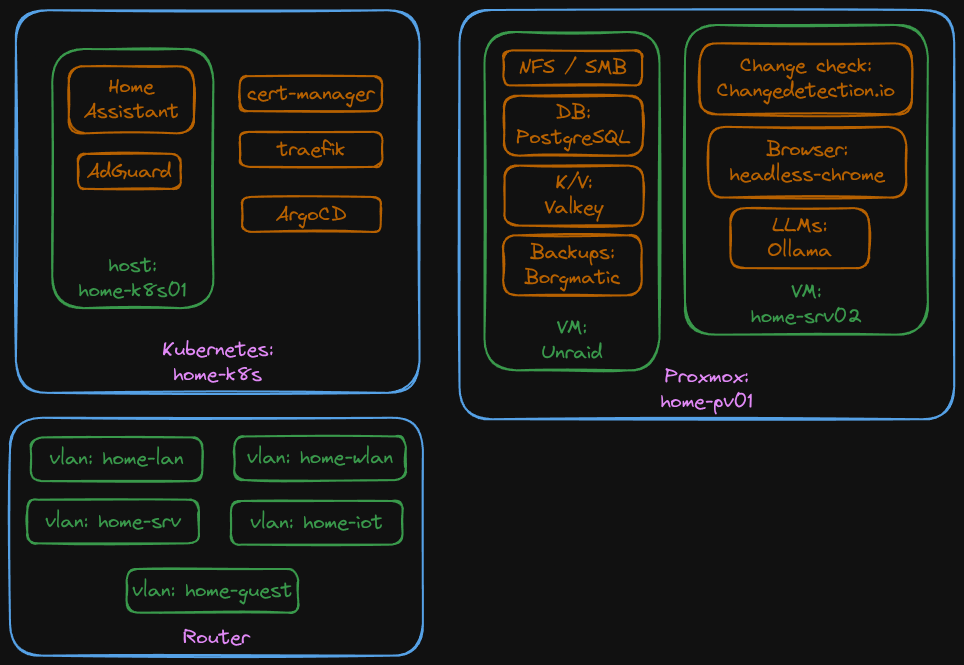

# Sigurs' GitOps Repository
The main purpose is GitOps, but also contains Ansible IaaC for cluster setup.<br>
Combined for ease of use.

The long-term goal is to combine numerous independent docker-compose and kubernetes setups into 2-3 clusters for ease of management.

## General Information
This is the public gitops repo, but a private one also exists.  
Both are used to deploy software to these clusters, so not everything is visible here.  
This also has an effect on deployment patterns.  

With regards to security, the clusters default to enforcing UserNamespaces and restricted PodSecurityAdmission profiles.  
Firewalls and NetworkPolicies are mainly default deny for incoming and outgoing traffic.  
Where Cilium is used, Cilium's CiliumClusterwideNetworkPolicies are used for host firewall rules.


# Clusters

## Proxima
Cluster located mainly in Hetzner Cloud.  
Replaces the old hcloud-cluster01.  

## Cluster info
Kubernetes: k3s  
Networking:
- CNI used is Cilium that is configured to use native routing. Traffic routed through Hetzner Cloud Networks.
- Instead of utilizing Hetzner's (paid) load balancers, by default Cloudflared is used for incoming traffic.


## Cluster: hcloud-cluster01
Cluster in Hetzner cloud. Publically accessible.<br>
Bit of a fast setup and not ideal.

## Cluster: home-k8s
### Drawing (work in progress)


Cluster located at home. No public access.<br>
HA is not the goal here due to different hardware.<br>
Utilizes Ansible.

Highlights:
- [UserNamespacesSupport](https://kubernetes.io/docs/tasks/configure-pod-container/user-namespaces/) is used for security due to some containers requiring root.

### Nodes
- home-k8s01
    - RaspberryPi 5 8GB
- home-k8s02 (upcoming)
    - VM running inside Proxmox
- xxx (upcoming)
    - Desktop with GPU resources.

### Services
#### Service:  AdGuard Home
Please not that AdGuard needs to be deployed with --server side flag.<br>
This is due to kubectl not being able to handle multiple protocols on the same port.<br>
Example: `kubectl apply --server-side --force-conflicts -n prod-adguard -k .`

Requires root on first start - or UserNamespaces.


#### Service:  Home Assistant
Configuration Migrated from a previous setup.<br>
Utilizes UserNamespaces to mitigate security concerns related to needing to be started as root.<br>
TODO: Bluetooth & other devices

#### Service: cert-manager
Used as a Certificate Authority for applications and for requesting Let's Encrypt certificates. <br>
Let's Encrypt ClusterIssuer yamls need to be manually filed and ran.

#### Service: system-upgrade
Utilize k3s' system-upgrade-controller to keep nodes up to date.

## Usage
### Ansible

#### Setup ansible
```bash
# Create virtual environment
python3 -m venv .venv
source .venv/bin/activate

# Install ansible
python -m pip install ansible
ansible-galaxy collection install community.general kubernetes.core
```

#### Run

```bash
# Activate virtual environment
source .venv/bin/activate

# Run ansible
ansible-playbook ansible/k3s-cluster/main.yaml -i home-k8s/ansible-inventory.yaml
```

# Unraid
At home the main storage solution is based on Unraid. <br>
As the kubernetes nfs CSI is yet to support user namespaces, I need to run certain software via Unraid's docker capabilities. <br>
All of these are ran with `--security-opt=no-new-privileges --cap-drop=all --user xxx:xxx` to prevent privilege escalation issues - we are running public containers here so you can never be too careful :) <br>

Running some of these directly on the storage also improves performance.<br>

## Unraid: PostgreSQL 17
Postgres is a database I host on unraid for performance reasons - it's nvme backed.

## Unraid: valkey (redis fork)
Certain software requires a k/v store. 

## Unraid: borgmatic
Backup solution that takes all the files, database dumps, etc. and backs them up offsite.